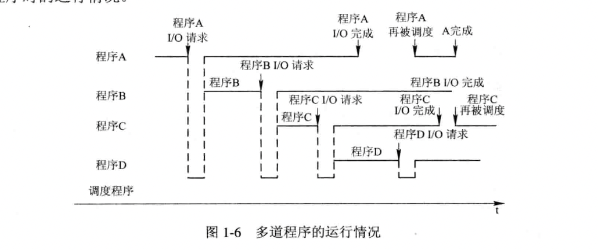

# 第一章 操作系统引论

## 操作系统的目标和作用 

### 操作系统的目标
在计算机系统上配置操作系统，其主要的目标是：方便性，有效性，可扩展性和开放性。
### 操作系统的使用 

1. OS作为用户与计算机硬件系统之间的接口 
OS处于用户与计算机硬件系统之间，用户通过OS来使用计算机系统。

2. OS作为计算机系统资源管理的管理者
计算机资源分为 
3. OS实现了对计算机资源的抽象

## 操作系统的发展过程

### 单道批处理系统
缺点 系统中的资源得不到充分的利用。因为内存中仅有一道程序，每逢该程序在运行中发出的I/O请求之后，CPU便处于等待状态，必须在其I/O完成之后才继续进行，又因I/O设备的低速性，更使CPU的利用率显著降低 

### 多道批处理系统
优缺点：
(1) 资源利用率高。多道程序交替运行，以保持CPU处于忙碌状态。在内存中装入多道程序可提高内存的利用率；此外还可以提高I/O设备的利用率
(2)系统吞吐量大。第一 CPU和其他资源保持"忙碌"状态 第二 仅当作业完成时或运行不下去时才进行切换，系统开销小
(3)平均周转时间长。由于作业要排队依次进行处理，因而作业的周转时间较长。
(4)无交互能力

### 分时操作系统
(1)多路性
(2)独立性
(3)及时性
(4)交互性

### 实时操作系统

### 微机操作系统的发展

## 操作系统的基本特性

#### 并发

1. 并发和并行
并行：指两个或多个事件在同一时刻发生。
并行：指在一段时间内宏观上有多个程序同时进行，微观上这些程序只能是分时地交替执行
2. 引入进程
进程：指系统中能独立运行并作为资源分配的基本单位，它是由一组机器指令、数据和堆栈等组成的，是一个能独立运行的活动实体

#### 共享

1. 互斥共享方式
规定在一段时间内，只允许一个进程访问该资源。若其他进程请求访问该资源，必须等待正在访问的进程访问完毕并释放资源之后，才允许另一个进程对该资源进行访问。这种资源共享方式称为互斥式共享。
临界资源（独占资源）：这段时间内只允许一个进程访问的资源。例如大多数的物理设备，以及栈、变量和表格。
2. 同时访问方式
系统中还有另外一类资源，允许在一段时间内由多个进程“同时”对它们进行访问。”同时“指的是宏观意义上的，在微观上，对该资源的访问是交替进行的。例如磁盘设备。

#### 虚拟

1. 时分复用技术
（1）虚拟处理机技术
利用多道程序设计技术，为每道程序建立至少一个进程，让多道程序并发执行。
（2）虚拟设备技术 
通过时分复用技术，将一台物理I/O设备虚拟为多台逻辑上的I/O设备，并允许每个用户占用一个逻辑上的I/O设备。

2. 空分复用技术
利用存储器的空闲空间分区域存放和运行其他的多道程序

#### 异步

以不可预知的速度向前推进，进程的异步性

### 操作系统的主要功能

#### 处理机管理功能

在传统的多道程序系统中，处理机的分配和运行都是以进程为基本单位的，因而对处理机的管理可归结为对进程的管理。例如，创建和撤销进程，对进程进行协调，实现进程之间信息交换，以及按照一定的算法把处理机分配给其他进程。

1. 进程控制 
为作业创建进程、撤销已结束的进程，以及控制进程在运行过程中的状态转换。

2. 进程同步
为多个进程的运行进行协调。常见的方式有两种：第一种，进程互斥方式，指进程在对临界资源进行访问时，应采用互斥方式。第二，进程同步方式，指在相互合作区完成共同任务的诸进程间，由同步机构对他们的执行次序加以协调。PV操作。

3. 进程通信
实现相互合作进程之间的信息交换

4. 调度
（1）作业调度 。作业调度的基本任务时从后备队列中按照一定的算法选择出若干作业，为它们分配运行所需的资源，在将这些作业调入内存后，分别为它们建立进程，使它们都成为可能获得处理机的就绪就绪进程，并将它们插入到就绪队列中。
（2）进程调度。进程调度的任务是从进程的就绪队列中按照一定的算法选出一个进程，将处理机分配给它，并为它设置运行现场。

#### 存储器管理功能

主要是任务就是为多道程序的运行提供良好的环境，提高存储器的利用率，方便用户使用，并能从逻辑上扩充内存。为此，存储器管理应具有内存分配和回收、内存保护、地址映射和内存扩充等。

1. 内存分配 
（1）为每道程序分配内存空间，使它们“各得其所”
（2）提高存储器的利用率，尽量减少不可用的内存空间（碎片）
（3）允许正在运行的程序申请附加的内存空间，以适当程序和数据动态增长的需要

OS在实现内存分配时，可采用静态和动态两种方式
（1）静态分配方式。每个作业的内存空间是在作业装入时确定的，在作业装入后的整个运行期间不允许该作业再申请新的内存空间，也不允许作业在内存中’移动‘
（2）动态分配方式。 每个作业所要求的基本内存空间虽然也是在装入时确定的，但允许作业在运行过程中继续申请新的附加内存空间，以适应程序和数据的动态增长，页允许作业在内存中“移动

2. 内存保护 

（1）独立运行，互不干扰
（2）不允许访问OS的程序和数据
在各自的内存去运行，设置两个界限寄存器，用于存放执行程序的上界和下界，防止越界。

3. 地址映射

逻辑地址->物理地址

4. 内存扩充
   
虚拟技术，从逻辑上扩充内存容量
（1）请求调入功能
（2）置换功能

#### 设备管理功能

主要任务：
（1）完成用户进程提出的I/O请求，为用户进程分配所需要的的I/O设备，并完成指定的I/O操作
（2）提高CPU和I/O设备的利用率，提高I/O速度

1. 缓冲管理

在I/O设备和CPU之间引入缓冲，有效的解决CPU和I/O设备速度不匹配矛盾

2. 设备分配管理

根据现有资源的情况按照某种算法分配I/O设备

3. 设备处理

设备驱动程序。实现CPU和设备控制器之间的通信。 

#### 文件管理功能

1. 文件存储空间的管理 
2. 目录管理
3. 文件的读/写管理和保护

#### 操作系统与用户之间的接口

1. 用户接口 
 操作系统向用户提供了命令接口，用户可通过该接口向作业发出命令以控制作业的运行。
 （1） 联机用户接口。
 （2） 脱机用户接口。
 （3） 图形用户接口。

2. 程序接口 
  程序接口是为用户程序在执行中访问系统资源设置的，是用户程序去的操作系统服务的唯一途径。系统调用

#### 现代操作系统的新功能

1. 系统安全
（1）认证技术。
（2）密码技术。
（3）访问技术控制，可通过两种途径来保证系统中的资源的安全：1 对用户存取权限的设置。 2 对文件属性控制保证文件的安全
（4）反病毒技术。

2. 网络的功能和服务 
 （1）网络通信 
 （2）资源管理 
 （3）应用互操作 

3. 支持多媒体
（1）接纳控制功能
（2）实时调度
（3）多媒体文件的存储
