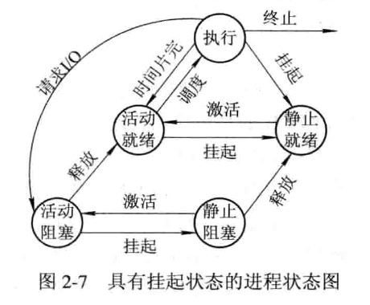
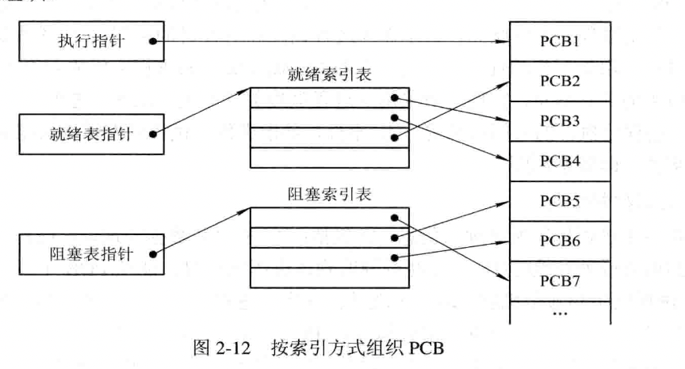
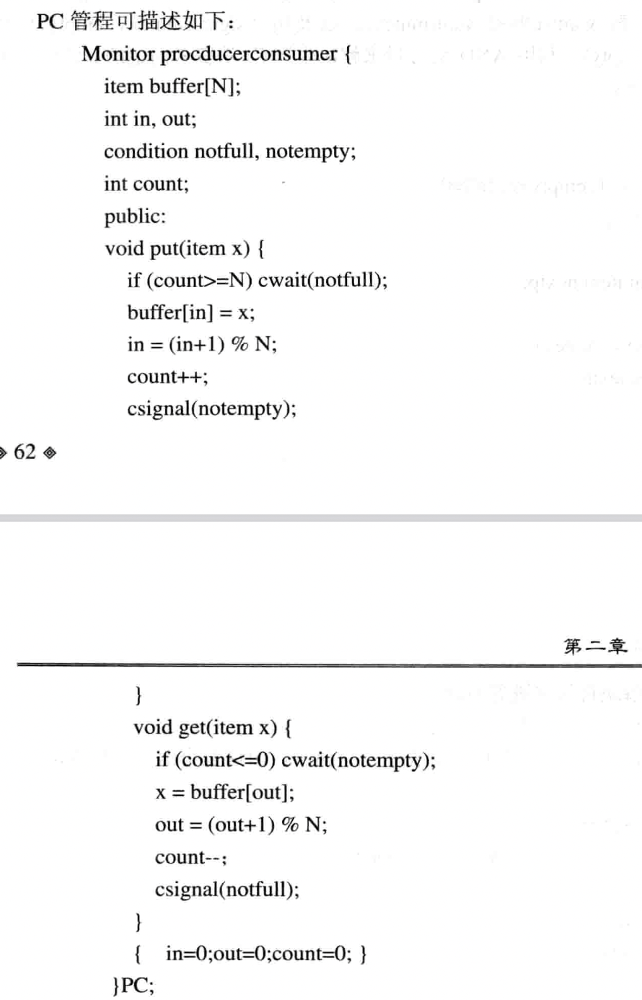
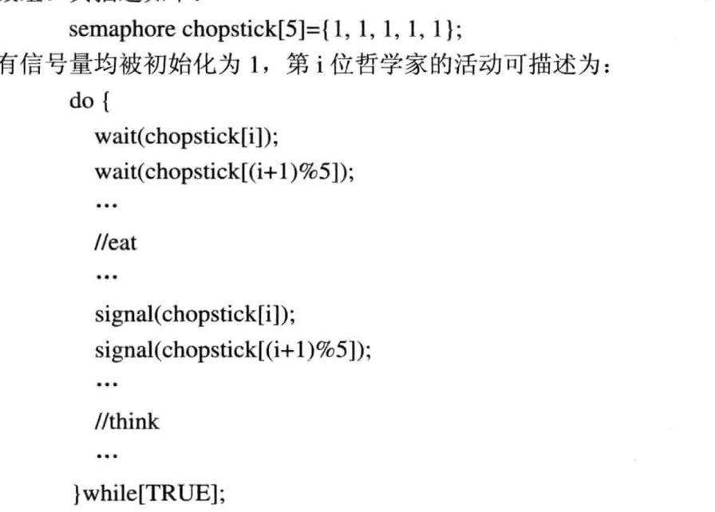

# 第一章 操作系统引论

## 操作系统的目标和作用 

### 操作系统的目标
在计算机系统上配置操作系统，其主要的目标是：方便性，有效性，可扩展性和开放性。
### 操作系统的使用 

1. OS作为用户与计算机硬件系统之间的接口 
OS处于用户与计算机硬件系统之间，用户通过OS来使用计算机系统。

2. OS作为计算机系统资源管理的管理者
计算机资源分为 
3. OS实现了对计算机资源的抽象

## 操作系统的发展过程

### 单道批处理系统
缺点 系统中的资源得不到充分的利用。因为内存中仅有一道程序，每逢该程序在运行中发出的I/O请求之后，CPU便处于等待状态，必须在其I/O完成之后才继续进行，又因I/O设备的低速性，更使CPU的利用率显著降低 

### 多道批处理系统
优缺点：
(1) 资源利用率高。多道程序交替运行，以保持CPU处于忙碌状态。在内存中装入多道程序可提高内存的利用率；此外还可以提高I/O设备的利用率
(2)系统吞吐量大。第一 CPU和其他资源保持"忙碌"状态 第二 仅当作业完成时或运行不下去时才进行切换，系统开销小
(3)平均周转时间长。由于作业要排队依次进行处理，因而作业的周转时间较长。
(4)无交互能力

### 分时操作系统
(1)多路性
(2)独立性
(3)及时性
(4)交互性

### 实时操作系统

### 微机操作系统的发展

## 操作系统的基本特性

#### 并发

1. 并发和并行
并行：指两个或多个事件在同一时刻发生。
并行：指在一段时间内宏观上有多个程序同时进行，微观上这些程序只能是分时地交替执行
2. 引入进程
进程：指系统中能独立运行并作为资源分配的基本单位，它是由一组机器指令、数据和堆栈等组成的，是一个能独立运行的活动实体

#### 共享

1. 互斥共享方式
规定在一段时间内，只允许一个进程访问该资源。若其他进程请求访问该资源，必须等待正在访问的进程访问完毕并释放资源之后，才允许另一个进程对该资源进行访问。这种资源共享方式称为互斥式共享。
临界资源（独占资源）：这段时间内只允许一个进程访问的资源。例如大多数的物理设备，以及栈、变量和表格。
2. 同时访问方式
系统中还有另外一类资源，允许在一段时间内由多个进程“同时”对它们进行访问。”同时“指的是宏观意义上的，在微观上，对该资源的访问是交替进行的。例如磁盘设备。

#### 虚拟

1. 时分复用技术
（1）虚拟处理机技术
利用多道程序设计技术，为每道程序建立至少一个进程，让多道程序并发执行。
（2）虚拟设备技术 
通过时分复用技术，将一台物理I/O设备虚拟为多台逻辑上的I/O设备，并允许每个用户占用一个逻辑上的I/O设备。

2. 空分复用技术
利用存储器的空闲空间分区域存放和运行其他的多道程序

#### 异步

以不可预知的速度向前推进，进程的异步性

### 操作系统的主要功能

#### 处理机管理功能

在传统的多道程序系统中，处理机的分配和运行都是以进程为基本单位的，因而对处理机的管理可归结为对进程的管理。例如，创建和撤销进程，对进程进行协调，实现进程之间信息交换，以及按照一定的算法把处理机分配给其他进程。

1. 进程控制 
为作业创建进程、撤销已结束的进程，以及控制进程在运行过程中的状态转换。

2. 进程同步
为多个进程的运行进行协调。常见的方式有两种：第一种，进程互斥方式，指进程在对临界资源进行访问时，应采用互斥方式。第二，进程同步方式，指在相互合作区完成共同任务的诸进程间，由同步机构对他们的执行次序加以协调。PV操作。

3. 进程通信
实现相互合作进程之间的信息交换

4. 调度
（1）作业调度 。作业调度的基本任务时从后备队列中按照一定的算法选择出若干作业，为它们分配运行所需的资源，在将这些作业调入内存后，分别为它们建立进程，使它们都成为可能获得处理机的就绪就绪进程，并将它们插入到就绪队列中。
（2）进程调度。进程调度的任务是从进程的就绪队列中按照一定的算法选出一个进程，将处理机分配给它，并为它设置运行现场。

#### 存储器管理功能

主要是任务就是为多道程序的运行提供良好的环境，提高存储器的利用率，方便用户使用，并能从逻辑上扩充内存。为此，存储器管理应具有内存分配和回收、内存保护、地址映射和内存扩充等。

1. 内存分配 
（1）为每道程序分配内存空间，使它们“各得其所”
（2）提高存储器的利用率，尽量减少不可用的内存空间（碎片）
（3）允许正在运行的程序申请附加的内存空间，以适当程序和数据动态增长的需要

OS在实现内存分配时，可采用静态和动态两种方式
（1）静态分配方式。每个作业的内存空间是在作业装入时确定的，在作业装入后的整个运行期间不允许该作业再申请新的内存空间，也不允许作业在内存中’移动‘
（2）动态分配方式。 每个作业所要求的基本内存空间虽然也是在装入时确定的，但允许作业在运行过程中继续申请新的附加内存空间，以适应程序和数据的动态增长，页允许作业在内存中“移动

2. 内存保护 

（1）独立运行，互不干扰
（2）不允许访问OS的程序和数据
在各自的内存去运行，设置两个界限寄存器，用于存放执行程序的上界和下界，防止越界。

3. 地址映射

逻辑地址->物理地址

4. 内存扩充
   
虚拟技术，从逻辑上扩充内存容量
（1）请求调入功能
（2）置换功能

#### 设备管理功能

主要任务：
（1）完成用户进程提出的I/O请求，为用户进程分配所需要的的I/O设备，并完成指定的I/O操作
（2）提高CPU和I/O设备的利用率，提高I/O速度

1. 缓冲管理

在I/O设备和CPU之间引入缓冲，有效的解决CPU和I/O设备速度不匹配矛盾

2. 设备分配管理

根据现有资源的情况按照某种算法分配I/O设备

3. 设备处理

设备驱动程序。实现CPU和设备控制器之间的通信。 

#### 文件管理功能

1. 文件存储空间的管理 
2. 目录管理
3. 文件的读/写管理和保护

#### 操作系统与用户之间的接口

1. 用户接口 
 操作系统向用户提供了命令接口，用户可通过该接口向作业发出命令以控制作业的运行。
 （1） 联机用户接口。
 （2） 脱机用户接口。
 （3） 图形用户接口。

2. 程序接口 
  程序接口是为用户程序在执行中访问系统资源设置的，是用户程序去的操作系统服务的唯一途径。系统调用

#### 现代操作系统的新功能

1. 系统安全
（1）认证技术。
（2）密码技术。
（3）访问技术控制，可通过两种途径来保证系统中的资源的安全：1 对用户存取权限的设置。 2 对文件属性控制保证文件的安全
（4）反病毒技术。

2. 网络的功能和服务 
 （1）网络通信 
 （2）资源管理 
 （3）应用互操作 

3. 支持多媒体
（1）接纳控制功能
（2）实时调度
（3）多媒体文件的存储

### OS结构设计

#### 传统操作系统结构

1. 无结构操作系统
2. 模块化结构OS
（1）模块化程序设计的基本概念
3. 分层式结构OS

#### 客户/服务器模式简介

1. 客户/服务器模式的由来、组成和类型 
2. 客户/服务器之间的交互
3. 客户/服务器模式的优点

#### 面向对象程序技术

1. 对象 
2. 对象类 
3. 继承

面向对象技术的优点

#### 微内核OS结构

1. 微内核操作系统的基本概念 
（1）足够小的内核
（2）基于客户/服务器模式
（3）应用“机制与策略分离”原理
（4）采用面向对象技术
2. 微内核的基本功能 
（1）进程（线程）管理
（2）低级存储器管理
（3）中断和陷入处理 
3. 微内核操作系统的优点
可拓展性 可靠性 可移植性 对分布式系统的支持 面向对象技术 

4. 微内核存在问题 

## 进程的描述与控制

### 前驱图和程序执行 

#### 前驱图 

作用：用于描述程序执行先后顺序
定义：一个有向无循环图（DAG），用于描述进程之间执行的先后顺序。
每个结点可用来表示一个进程或程序段，乃至一条语句，结点之间的有向边表示两个节点之间存在的偏序或前驱关系。
初始结点：没有前驱的结点
终止结点：没有后继的结点。
重量（weight）：每个结点含有一个重量，用于表示该结点所含的程序量或程序的执行时间。

#### 程序顺序执行

1. 程序的顺序执行 
2. 程序顺序执行时的特征
   顺序性：
   封闭性：程序在封闭的环境下运行，运行时独占全机资源，资源的状态只有本程序才能改变它，程序一旦开始执行，其执行结果不受外界因素影响
   可再现性：只要程序执行时的环境和初始条件相同，当程序重复执行时，不论它时从头到尾不停顿地执行，还是走走停停，都可获得相同的结果。

#### 程序并发执行

只有在不存在前驱关系的程序之间才可能并发执行，否则无法并发执行。
1. 程序的并发执行
2. 程序并发执行时的特征
  （1）间断性。程序在并发执行时，由于它们共享系统资源，以及完成同一项任务而相互合作，致使在这些并发执行的程序之间形成了相互制约的关系。“执行-暂停-执行”
  （2）失去封闭性。当系统中存在着多个可以并发执行的程序时，系统中的各种资源将为它们所共享，而这些资源的状态也由这些程序来改变，致使其中任一程序在运行时，其环境都必然会收到其他程序的影响。
  （3）不可再现性。程序在并发执行时，由于失去了封闭性，也将导致其又失去了可再现性。

### 进程的描述

#### 进程的定义和特征 

1. 进程的定义
进程控制块（PCB）：一种数据结构，用来描述进程的基本情况和活动过程，进而控制和管理进程。
进程实体-进程（进程映像）：由程序段、相关的数据段和PCB组成。
定义：
（1）进程是程序的一次执行。
（2）进程是一个程序及其数据在处理机上顺序执行时所发生的活动。
（3）进程是具有独立功能的程序在一个数据集合上运行的过程，它是系统进行资源分配和调度的一个独立单位。
总结：进程是进程实体的运行过程，是系统进行资源分配和调度的一个独立单位

2. 进程的特征
  （1）动态性。
  （2）并发性。
  （3）独立性。
  （4）异步性。

#### 进程的基本状态及转换

1. 进程的三种基本状态 
  （1）就绪态。指进程已处于准备好运行的状态，即进程已分配到除CPU以外的所有必要资源后，只要再获得CPU，便可立即执行。
  （2）执行态。已获得CPU，其程序正在执行的状态。
  （3）阻塞态。指正在执行的进程由于发生某事件（I/O，申请缓冲区失败）等暂时无法继续执行时的状态，亦即进程的执行收到阻塞。

2. 三种基本状态的转换 
   
3. 创建状态和终止状态 

  1）创建状态
  进程申请空白的PCB，并向PCB中填写用于控制和管理进程的信息，然后为该进程分配所必须的资源，最后，将该进程转入就绪状态并插入就绪队列。
  2）终止状态
  等待OS进行善后处理，最后将其PCB清空，并将PCB空间返回给系统。
  

#### 挂起操作和进程状态的转换 

1. 挂起操作的引入 
  （1）终端用户的需要。
  （2）父进程请求。
  （3）负荷调节的需要
  （4）操作系统的需要 
2. 引入挂起原语操作后三个进程状态的转换
   （1）活动就绪->静止就绪。
   （2）活动阻塞->静止阻塞。
   （3）静止就绪->活动就绪。
   （4）静止阻塞->活动阻塞
  
3. 引入挂起操作后五个进程状态的转换 

  

#### 进程管理中的数据结构 

1. 操作系统中用于管理控制的数据结构 
 资源信息表（进程信息表）：对每个资源和每个进程都设置了一个数据结构，用于表征其实体，其中包含了资源或进程的标识、描述、状态等信息以及一批指针。
 

2. 进程控制块PCB的作用 

（1）作为独立运行基本单位的标志。PCB是进程存在与系统中的唯一标志。
（2）能实现间断性运行方式。
（3）提供进程管理所需要的信息。
（4）提供进程调度所需要的信息。
（5）实现与其他进程的同步与通信。

3. 进程控制块中的信息
  1）进程标识符
  用于唯一地标识一个进程。
  （1）外部标识
  （2）内部标识
  2）处理机状态
  处理机信息也称为处理的上下文，主要是由处理机的各种寄存器中的内容组成。
  通用寄存器（用户可见寄存器）、指令计数器、程序状态字PSW、用户栈指针、
  3）进程调度信息
  进程状态、进程优先级、进程调度所需其他信息、事件
  4）进程控制信息 
  程序和数据的地址、进程同步和通信机制、资源清单、链接指针

4. 进程控制块的组织方式 
  （1）线性方式
  （2）链接方式
  （3）索引方式

### 进程控制 

进程控制一般由OS的内核中的原语来实现
#### 操作系统内核 

系统态 ： 又称为管态，也称为内核态，它具有较高的特权，能执行一切指令，访问所有寄存器和存储区，传统的OS都在系统态运行。
用户态：又称为目态，具有较低特权的执行状态，仅能执行规定的指令，访问特定的寄存器和存储区，一般情况下，应用程序只能在用户态运行，不能取执行OS指令及访问OS区域，以防止应用程序对OS的破坏。

1. 支撑功能 
  （1）中断处理。
  （2）时钟管理。
  （3）原语操作。由若干条指令组成的，用于完成一定功能的一个过程。它与一般过程的区别在于，它们是“原子操作”，指一个操作中的所有动作要么全不做，要么全做。它是一个不可分割的基本单位，因此原语在执行过程中不允许被中断，原子操作在系统态下执行，常驻内存。

2. 资源管理功能 
   （1）进程管理
   （2）存储器管理
   （3）设备管理
#### 进程的创建 

1. 进程的层次结构 
2. 进程图 
描述进程家族关系的有向树
3. 引起创建进程的事件
   （1）用户登陆
   （2）作业调度
   （3）提供服务
   （4）应用请求
4. 进程的创建
  （1）申请空白的PCB，为新进程申请获得唯一的数字标识符，并从PCB集合中索取一个空白PCB
  （2）为新进程分配其运行所需的资源，包括各种物理和逻辑资源，如内存、文件、I/O设备和CPU时间等。
  （3）初始化进程控制块（PCB）
  （4）如果进程就绪队列能够接纳新进程，便将新进程插入就绪队列。

#### 进程的终止 

1. 引起进程终止的事件
   （1）正常结束
   （2）异常结束。
   常见的异常事件：
   越界错：指程序所访问的存储区，已越出该进程的区域
   保护错：指进程试图取访问一个不允许访问的资源或文件，或者以不适当的方式进程访问，例如，去写一个只读文件。
   非法指令：指程序试图去执行一条不存在的指令
   特权指令错：指用户进程试图去执行一条只允许OS执行的指令
   运行超时：指进程的执行时间超过了指定的最大值
   等待超时：指进程等待某事件的时间超过了规定的最大值
   算术运算错：指进程试图去执行一个被禁止的运算
   I/O故障：指I/O过程中发生了错误
   （3）外界干预
2. 进程的终止过程 
   

#### 进程的阻塞与唤醒 

1. 引起进程阻塞和唤醒的事件 
   （1） 向系统请求共享资源失败。
   （2）等待某种操作的完成。
   （3）新数据尚未到达。
   （4）等待新任务的到达
2. 进程阻塞过程
  通过调用阻塞原语block将自己阻塞。
3. 进程唤醒过程 
  调用wakeup原语唤醒：首先将被阻塞的进程从等待该事件的阻塞队列中移出，将其PCB中的现行状态由阻塞态改为就绪，然后再将PCB插入到就绪队列中。

#### 进程的挂起与激活 

1. 进程的挂起 
  使用suspend挂起原语将指定进程或处于阻塞状态的进程挂起。活动就绪 ->  静止就绪 。
  活动阻塞 -> 静止阻塞 
2. 进程的激活过程 
  使用active原语激活进程。

### 进程同步 

#### 进程同步的基本概念 

  同步机制的主要任务：对多个相关进程在执行次序上进行协调，使并发执行的诸进程之间能按照一定的规则（或时序）共享系统资源

  1. 两种形式的制约关系 
   1）间接相互制约关系 
   访问共享系统资源（同一时间只允许一个进程访问），所以形成了间接相互制约关系。
   2）直接相互制约关系
   完成同一项任务的两个进程而相互合作。例如A输入进程，B计算进程，共享一个缓冲区，进程A向B提供数据，B从缓冲区中取出数据。
  2. 临界资源
   对临界资源（打印机、磁带机）的访问，诸进程之间应采用互斥方式。
   生产者-消费者
  3. 临界区 
   临界区：把每个进程中访问临界资源的那段代码称为临界区。
  4. 同步机制应遵循的规则
   （1）空闲让进：当无进程进入自己的临界区，表明临界资源处于空闲状态，应允许一个请求进入临界区的进程立即进入自己的临界区，以有效地利用临界资源。
   （2）忙则等待：当已有进程进入临界区时，表明临界资源正在被访问，因而其它试图进入临界区的进程必须等待，以保证对临界资源的护持访问。
   （3）有限等待：对要求访问临界资源的进程，应保证在有限时间内能进入自己的临界区，以免陷入“死等”状态。
   （4）让权等待：当进程不能进入自己的临界区时，应立即释放处理机，以免进程陷入“忙等”状态

   

#### 硬件同步机制 

1. 关中断 
2. 利用Test-and-Set 指令实现互斥
3. 利用Swap指令实现进程互斥
  不符合“让权等待”

#### 信号量机制

1. 整型信号量 
  S：表示资源数目的整型量S 
  wait（S）和signal（S） -> P、V操作
    
    未遵循让权等待

2. 记录型信号量 
 

3. AND型信号量
  基本思想：将进程在整个运行过程中需要的所有资源，一次性全部地分配给进程，待进程使用完后再一起释放。只要尚有一个资源分配给进程，其它所有可能其它所有可能为之分配的资源也不分配给它。要么把它所请求的资源全部分配到进程，要么一个也不分配
 
4. 信号量集
  

#### 信号量的应用 
  
1. 利用信号量实现进程互斥
  设置mutex为互斥信号量，初始值为1，取值范围为（-1，0，1）。当mutex=1时，表示两个进程皆未进入需要互斥的临界区；当mutex=0时，表示有一个进程进入临界区运行，另一个必须等待，挂入阻塞队列；当mutex = -1时，表示有一个进程正在临界区运行，另一个进程因等待而阻塞在信号量队列中，需要被当前已在临界区运行的进程退出时唤醒。
   
   PV必须成对的出现。缺失P将会导致系统混乱，不能保证对临界区资源的互斥访问；缺少V操作将会使临界资源永远不被释放，从而使等待该资源而阻塞的进程不能被唤醒。
2. 利用信号量实现前趋关系
  设置信号量S，初始值为0，欲使P1进程的S1语句要在P2进程中的S2语句之前执行。
  在进程P1中，执行S1；signal(s)；
  在进程P2中，wait(s);执行S2；
  

#### 管程机制

1. 管程的定义 
  代表共享资源的数据结构以及由对该共享数据实施操作的一组过程所组成的资源管理程共同构成了一个操作系统的资源管理模块，称为管程
  组成：
  （1）管程的名称
  （2）局部于管程的共享数据结构说明
  （3）对该数据结构进行操作的一组过程
  （4）对局部于管程的共享数据设置初始值
管程包含了面向对象的思想，它将表征共享资源的数据结构及其数据结构操作的一组过程，包括同步机制，都集中并封装在一个对象内部，隐藏了实现细节

2. 条件变量 
  conditionx,y 
  (1)x.wait:正在调用管程的进程因x条件被阻塞或挂起，则调用x.wait将自己插入到x条件的等待队列上，并释放管程，直到x条件变化。
  （2）x.signal:正在调用管程的进程发现x条件发生了变化，则调用x.signal，重新启动一个因x条件而阻塞或挂起的进程，如果存在多个这样的进程，则选择其中的一个，如果没有，则继续执行原进程

### 经典进程的同步问题

#### 生产者-消费者 

1. 利用记录型信号量解决生产者-消费者问题

  假定在生产者和消费者之间的公用缓冲池中具有n个缓冲区，这时可利用mutex互斥信号量实现进程对缓冲池的互斥使用。利用信号量empty和full分别表示缓冲池中空缓冲区和满缓冲区的数量。只要缓冲池未满，生产者便可将消息送入缓冲池；只要缓冲池未空，消费者便可从缓冲池中取走一个消息。
  **注意：** 每个程序用于实现互斥的wait和signal必须成对地出现；其次，对资源信号量empty和full的PV操作，同样也需要成对出现，但它们分别处于不同的程序中。

2. 利用AND信号量解决生产者-消费者问题
  用Swati(empty,mutex)来代替wait(empty)和wait(mutex)
  
  

3. 利用管程解决生产者-消费者问题
  PC管程描述：

管程解决描述：

### 哲学家进餐问题 

一个圆桌，五把椅子，五个碗，五只筷子。只有拿到两只筷子才能进餐。

1. 利用记录型信号量解决哲学家进餐问题 
  筷子是临界资源，在一段时间内只允许一位哲学家使用。

当哲学家饥饿时，总是先去拿他左边的筷子，再去拿他右边的筷子。
问题：可能发生死锁，如果五位哲学家同时拿起左边的筷子，再去拿右边的筷子时，都会因为无筷子可拿而导致无限期等待。
解决办法：
（1）至多只允许有四位哲学家同时取拿左边的筷子，最终能保证至少有一位哲学家能够进餐，并在用完时，能释放出他用过的两只筷子，从而使更多的哲学家能够进餐。
（2）仅当哲学家的左右两只筷子均可用时，才允许他拿起筷子进餐。
（3）规定奇数号哲学家先拿他左边的筷子，然后再去拿右边的筷子；而偶数号哲学家则相反。那么，1，2号哲学家竞争1号筷子；3，4号哲学家竞争3号筷子。即五位哲学家都先去竞争奇数筷子，获得后再去竞争偶数号筷子，最后总会有一位哲学家能获得两只筷子而进餐。

2. 利用AND信号量机制解决哲学家进餐问题 
  

#### 读者-写者问题

一个数据文件可被多个进程共享，读该文件的进程称为“Reader进程”，其它进程称为“Writer进程”。允许多个进程同时读一个共享对象，因为读操作不会使数据文件混乱。但不允许一个Writer进程和其它Reader进程或Writer进程同时访问共享对象。-> Writer进程必须和其它进程互斥的访问共享对象。

1. 利用记录型信号量解决读者-写者问题
  Wmutex：Reader进程与Writer进程的互斥信号量
  Readcount：正在读的进程数
  Rmutex：Readcount：正在读的进程数是一个可被多个Reader进程访问的临界资源，所以为它设置一个互斥信号量rmutex。

   

2. 利用信号量集解决读者-写者问题 

### 进程通信 

#### 进程通信的类型

1. 共享存储器系统
  （1）基于共享数据结构的通信方式
  （2）基于共享存储区的通信方式
2. 管道(pipe)通信系统
   所谓”管道“，是指用于连接一个读进程和一个写进程以实现它们之间通信的一个共享文件，又称为pipe文件。向管道(共享文件)提供输入的发送进程（即写进程）以字符流形式将大量的数据送入管道；而接受管道输出的接受进程（即读进程）则从管道中接受数据。由于发送进程和接受进程时利用管道进行通信的，故成为了管道通信。
   为了协调双方的通信，管道机制必须提供以下三方面的协调功能：
   （1）互斥 
   （2）同步
   （3）确定对方是否存在，只有确定了对方已存在时才能进行通信。
3. 消息传递系统 
  在该机制中，进程不必借助任何共享存储区或数据结构，而是以格式化的消息为单位，将通信的数据封装在消息中，并利用操作系统提供的一组通信命令（原语），在进程间进行消息传递，完成进程间的数据交换。
  （1）直接通信方式：指发送进程利用OS所提供的发送原语，直接把消息发送给目标进程；
  （2）间接通信方式：指发送和接受进程，都通过共享中间实体（邮箱）的方式进行消息的发送和接受，完成进程间的通信。
4. 客户机-服务器系统
  
  1）套接字
  2）远程过程调用和远程方法调用

#### 消息传递通信的实现方式

1. 直接消息传递系统
  1）直接通信原语
  （1）对称寻址方式
  send（receiver，message）
  receive（sender，message）
  （2）非对称寻址方式
  send（P，message）
  seceive（id，message）
  （2）消息的格式
  （3）进程的同步方式
  （4）通信链路

2. 信箱通信
  1）信箱的结构
  （1）信箱头
  （2）信箱体
  2）信箱通信原语
  （1）信箱的创建和撤销
  （2）消息的发送和接受。
  3）信箱的类型
  （1）私用邮箱
  （2）公用邮箱
  （3）共享邮箱

#### 直接消息传递系统实例

1. 消息缓冲队列通信机制中的数据结构
  （1）消息缓冲区
  （2）PCB中有关通信的数据项
2. 发送原语
3. 接受原语
   

### 线程的基本概念 

#### 线程的引入 

1. 进程的两个基本属性

（1）进程是一个可拥有资源的独立单位。
（2）进程是一个可独立调度和分配的基本单位。

2. 程序并发执行所需付出的时空开销

3. 线程--作为调度和分配的基本单位 

#### 线程与进程的比较 

1. 调度的基本单位
  引入线程的OS中，线程作为调度和分配的基本单位，因而线程是能够独立运行的基本单位当线程切换时，仅需保存和设置少量寄存器内容，切换代价远低于进程。在同一进程中，线程的切换不会引起进程的切换，但从一个进程中的线程切换到另一个进程中的线程时，必然就会引起进程的切换。
2. 并发性 
  在引入线程的OS中，不仅进程之间可以并发执行，而且在一个进程中的多个线程之间亦可并发执行，甚至还允许在一个进程中的所有线程都能并发执行。同样，不同进程中的线程也能并发执行。
3. 拥有资源 
  进程可以拥有资源，并作为你系统中拥有资源的一个基本单位。然后，线程本身并不拥有系统资源，而是仅有一点必不可少的、能够保证独立运行的资源。允许多个线程共享该进程所拥有的所有的资源：属于同一进程的所有线程都具有相同的地址空间，意味着，线程可以访问该地址空间中的每一个虚拟地址；还可以访问进程所拥有的资源。
4. 独立性
  同一进程的不同线程的之间的独立性要比不同进程之间的独立性低得多。因为线程会共享同一进程的资源，访问所属进程地址空间中的所有地址。
5. 系统开销
  OS创建或撤销进程所付出的开销要比线程所付出的开销大的多
6. 支持多处理机系统
  